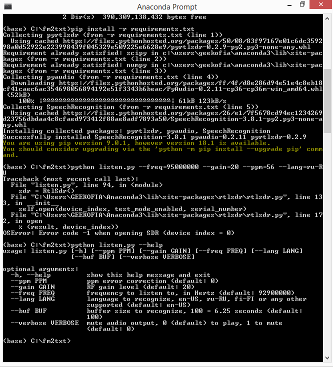

## Usage

- Unpack software archive into some folder, e.g. C:\fm2txt

- Go to [Anaconda](https://www.anaconda.com/download/) and choose Python 3.7 version, 64-Bit Graphical Installer
	or download directly: [From Here](https://repo.anaconda.com/archive/Anaconda3-5.3.0-Windows-x86_64.exe).

- Run anaconda prompt, change dir to C:\fm2txt, then run: `pip install -r requirements.txt`

- Last step is to copy 2 files from x64 folder of [osmocom rtl-sdr drivers](https://osmocom.org/attachments/download/2242/RelWithDebInfo.zip)/[Mirror](http://s000.tinyupload.com/?file_id=21142674869394817308)

- Copy these [rtl-sdr-release/x64/]: `rtlsdr.dll` & `libusb-1.0.dll` into `C:\Windows` folder.

- Now we may run, this will produce text recognition results file [radio_log.txt]:

	`python listen.py --freq=95000000 --gain=20 --ppm=56 --lang=ru-RU`

- Some unnecessary help available:

	`python listen.py --help`

- To mute audio output use verbose key:
	
	`python listen.py --verbose 1`

- List of supported languages and their codes: [Here](https://cloud.google.com/speech/docs/languages)

_Note:Recognition quality can be improved using paid Google, Microsoft, IBM or other services._

## Screenshots
